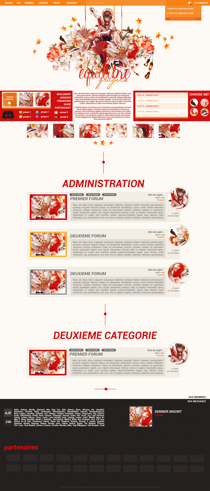

# Personnalisation d'un thème ForumActif - Scarlet Koi

## Présentation

Personnalisation de l'affichage de l'index d'un forum hébergé sur [Forumactif](https://www.forumactif.com/), basé sur une maquette fournie par [Sygea](http://wooruru.forumactif.com/). En raison de la présence d'une carpe rouge sur les illustrations, je lui ai donné le poétique nom de _Scarlet Koi_ (ou _Carpe Écarlate_ en français mais ça sonne moins classe).

<a href="./misc/preview_index.jpg"></a>

Le thème utilise la **version ModernBB** de Forumactif et n'est pas compatible par défaut avec les autres versions. Il comporte les modifications et composants suivants :
- Une barre de navigation qui inclut une barre de recherche et un bouton pour les notifications
- Un message d'accueil (PA)
- Des catégories personnalisées
- Un pied de page (dont le QEEL) modifié

Les templates *index_body*, *index_box*, *overall_footer_begin*, *overall_footer_end* et *overall_header* devront être modifiés pour l'installer.

## Règles d'utilisation

- Vous pouvez modifier ce code comme vous en avez envie ;
- Merci de ne pas redistribuer ce code à tort et à travers sur les forums d'entraide, même si vous l'avez modifié ;
- Merci de conserver les crédits présents dans ce code, même après modification (vous pouvez évidemment ajouter un "personnalisé par votrepseudo" si vous voulez) ;
- L'usage de ce code est destiné à un usage strictement personnel et non commercial ;
- Merci d'ajouter un lien retour vers le forum où vous aurez trouvé ces codes sur votre forum.

## Illustrations incluses dans le thème

**Note :** Elles ne sont pas incluses dans ce repository Github.
- Lien de l'image du header (le "logo" du forum) : https://i.goopics.net/vXRGe.png
- Image de séparation (la barre verticale) : https://i.goopics.net/O5x3w.png
- L'avatar par défaut : https://i.goopics.net/emAgj.png
- L'icone des notifications (pas de nouvelle notif): https://i.goopics.net/4NOkZ.png
- L'icone des notifications (nouvelle notification) : https://i.goopics.net/2powK.png
- L'illustration des forums : https://i.goopics.net/X2A0g.png
- L'image de fond du pied de page (QEEL) : https://i.goopics.net/d7gXr.png
- Les étoiles pour les top sites :
  - https://i.goopics.net/02472.png
  - https://i.goopics.net/xNdbj.png
  - https://i.goopics.net/Z2AGG.png

A vous de créer les autres images, à savoir :
- Les icones du staff (format 100x100px)
- Les icônes des personnages prédéfinis (format 50x50px)
- Les boutons de partenariat (format à votre choix)

## Réglages préalables

Pour que ce thème fonctionne au mieux, voici les réglages à avoir sur votre forum :
- **Réglez la structure des catégories :** dans votre panneau d'administration, onglet **Affichage → Page d'accueil → Structure et hiérarchie → Niveau de compression de l'index**, sélectionner l'option *Séparer les catégories sur l'index* : Moyen
- **Pour avoir les notifications, activez la toolbar :** Dans votre panneau d'administration, rendez vous dans l'onglet **Modules → Toolbar → Configuration** et cochez "Oui" pour l'option *"Activer la toolbar"*. Si vous n'aimez pas le système de notifications de Forumactif, cette étape n'est pas obligatoire. 
- **Désactivez la chatbox** : Elle est fonctionnelle, mais son affichage n'a pas été modifié pour ce thème. Il vous faudra trouver vous même comment la personnaliser sous modernBB si vous tenez à l'utiliser. Pour la désactiver, rendez vous dans votre panneau d'administration, onglet **Modules → Chatbox → Configuration** et sélectionnez "Non" pour l'option *"Activer la Chatbox"*.  
- **Désactivez l'affichage de la légende des statuts des messages** : Dans le panneau d'administration, sous l'onglet **Général → Messages et Emails → Configuration**, trouvez l'option *"Afficher la légende des statuts des messages"* et cochez "Non".  
- **Désactivez l'affichage de la connexion rapide** : Comme pour la chatbox, elle est fonctionnelle, mais pas personnalisée pour ce thème. Vous pourrez la désactiver dans votre panneau d'administration, onglet **Affichage → Page d'Accueil → Généralités → Général**, trouvez l'option *"Affichage de la connexion rapide"* et choisissez "Ne pas afficher".  
- **Déplacez le lien "Rechercher" :** J'ai choisi de laisser le bouton "Rechercher" dans la barre de navigation en plus de la recherche rapide, pour ceux qui préfèrent faire une recherche avancée. Idéalement, déplacez le dans la barre de navigation pour qu'il se trouve juste avant le bouton "S'enregistrer". Pour cela, rendez vous dans l'onglet **Affichage → Page d'accueil  → En-tête & Navigation  → Barre de navigation** et utilisez les flèches pour déplacer les éléments du menu. 
- **Activez l'affichage des sous-forums :** dans votre panneau d'administration, onglet **Affichage → Page d'accueil → Structure et hiérarchie → Hiérarchie**, réglez l'option *"Afficher les liens vers les sous-forums"* sur "Oui" ou "avec une image". 
- **Activez l'affichage du dernier message posté :** dans votre panneau d'administration, onglet **Affichage → Page d'accueil → Structure et hiérarchie → Hiérarchie**, réglez l'option *Afficher le titre du sujet du dernier message d'un forum sur l'index* sur "Oui"
- **Activez l'affichage de l'avatar du dernier posteur :** dans votre panneau d'administration, onglet **Affichage → Page d'accueil → Structure et hiérarchie → Hiérarchie**, réglez l'option *"Afficher les avatars dans la colonne "Derniers messages"* sur "Oui". 
- **Affichez la liste des membres connectés au cours des dernières heures :** dans votre panneau d'administration, onglet **Affichage → Page d'accueil → Généralités → Général**, réglez l'option *"Afficher la liste des membres connectés au cours des 24\* dernières heures :"* sur "Oui". (\* Vous pouvez changer la période).

## Autres détails

- Ce thème est prévu pour une largeur de forum de 1200px minimum
- Pour ajouter l'image du header, vous devez tout simplement changer le logo via le panneau d'administration (onglet **Affichage → Images et Couleurs → Gestion des Images → Mode Avancé** et mettre le lien de l'illustration du header pour le logo)
- Comme les groupes sont affichés sur le message d'accueil, ils ne sont pas présents dans le QEEL, ce n'est pas un oubli
- Les catégories n'utilisent pas les images définies dans le panneau d'administration pour les icônes du forum.

## Guide d'installation

Pour installer cet affichage sur votre forum en version ModernBB, vous allez devoir modifier les templates de base et rajouter un peu de CSS et de Javascript :

### Installation des templates
Remplacez vos templates *index_body*, *index_box*, *overall_footer_begin*, *overall_footer_end* et *overall_header* dans votre panneau d'administration (onglet **Affichage → Templates → Général**) par ceux fournis dans le dossier [/templates](./templates). N'oubliez pas de les enregistrer et de les valider.

### Installation de la feuille de styles CSS
Installez (et personnalisez) la feuille de styles CSS en copiant collant le code dans [/misc/scarletkoi.css](./misc/scarletkoi.css) dans **Affichage → Images et Couleurs → Couleurs**, onglet Feuille de style CSS. Cochez "non" à toutes les options du CSS.

Notez le code présent au début de la feuille de styles :

```css
/* définition des variables utilisées */
:root {
  (plein de trucs ici)
}
```

Je n'ai probablement pas pensé à tout, mais c'est ici que vous pourrez faire l'essentiel de vos modifications de couleurs et images. Aidez-vous du nom des variables et des commentaires pour savoir ce que vous modifiez. Le reste du code est commenté pour vous aider à vous repérer, mais en principe le nom des classes vous permet de savoir à quel élément vous avez affaire.

### Installation des scripts
Rendez-vous dans la gestion des codes Javascript de votre panneau d'administration (onglet **Modules → HTML & JAVASCRIPT → Gestion des codes Javascript**) et creéz un nouveau javacript pour chacun des scripts présents dans le dossier [/scripts/](./scripts/), avec les règles de placement suivantes :
- [Script de déplacement du message d'accueil](./scripts/script_deplacement_pa.js) : Activé sur l'index uniquement
- [Script du menu de navigation](./scripts/script_menu_navigation.js) : Activé sur toutes les pages
- [Script de l'avatar dans le QEEL](./scripts/script-avatar-qeel.js) : Activé sur l'index uniquement
- [Script des onglets dans le QEEL](./scripts/van11y-accessible-tab-panel-aria.min.js) : C'est celui qui a un nom "bizarre", il n'est pas de moi, comme vous pourrez le voir dans son contenu ^^ Il ne doit être **activé sur aucune page**. Une fois ce script enregistré, notez son URL dans la liste des scripts de votre forum, puis allez éditer le template `overall_footer_begin` et trouvez le texte `URL_SCRIPT_ONGLETS_SUR_VOTRE_FORUM`. Remplacez le par l'URL du script !

## Le message d'accueil (la PA)

### Caractéristiques

- Vous pouvez afficher un titre au dessus du message d'accueil
- Seules trois icones de staff (format 100*100) peuvent être mises sur le message d'accueil. N'essayez pas d'en rajouter ou d'en supprimer ou le code va avoir une drôle de tête.
- Il vaut mieux éviter d'avoir plus de 5 liens dans le menu de navigation
- Vous pouvez avoir plus (ou moins) de six groupes affichés (il vous faudra juste adapter la hauteur de la PA)
- Vous pouvez avoir plus (ou moins) de 4 images de prédéfinis affichés (il vous faudra juste adapter la hauteur de la PA)
- Vous pouvez mettre autant de partenaires et de tops que vous le souhaitez
- **Attention :** L'ordre des éléments dans le code ne correspond pas exactement à celui que vous pouvez voir à l'affichage ;) Aidez-vous des commentaires ou des noms de classes pour savoir ce qui correspond à quoi.

### Installation

Dans votre panneau d'administration, rendez vous dans l'onglet **Affichage → Page d'accueil → Généralités → Message sur la page d'accueil** et dans le champ de texte **Contenu du message** collez le code du message d'accueil [fourni ici](./misc/page-accueil.html).  
**Note :** Veillez à ce que le bouton "basculer le mode d'édition" au bout de la barre de mise en forme soit bien enfonçé (son fond doit être blanc).

## FAQ

### Mais où est la liste des sujets / l'affichage des messages / etc. ?
Il n'y en a pas (pour l'instant), ce code ne concerne que l'index du forum. Si Sygea fait une maquette pour ces éléments additionnels, je les ajouterai. En attendant, il faudra faire sans.

### Je voudrais juste récupérer les catégories seulement / la PA seulement / etc.
J'ai fait un petit [guide pour l'installation individuelle des éléments](./doc/installation-independante.md) si ça vous intéresse.

### Comment est-ce que je peux personnaliser le message d'accueil (la PA) ?
J'ai également fait un petit [guide de personnalisation du message d'accueil](.doc/../doc/personnalisation-pa.md) :)

### Comment est-ce que je peux personnaliser le QEEL ?
Là encore, il y a un [guide de personnalisation du QEEL](.doc/../doc/personnalisation-qeel.md) pour vous dépanner.

### Je ne trouve pas la réponse à ma question !
En cas de questions, vous pourrez me contacter sur Epicode (où j'ai partagé ce code) et potentiellement via la fonction "Issues" de github.
